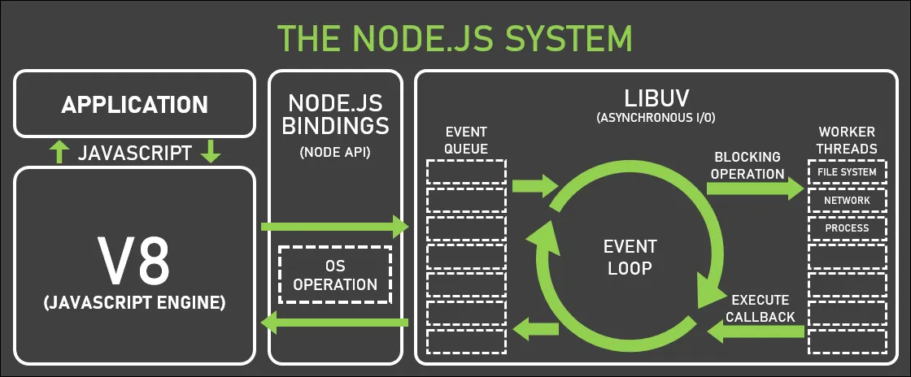

# NodeJS Event Loop

The event loop in Node.js is a mechanism that allows it to handle multiple asynchronous tasks concurrently within a single thread. It continuously listens for events and executes associated callback functions.




```js
console.log('Start of the program');

// Phase 1: Timers
setTimeout(() => {
  console.log('Timer phase: Timer callback executed! ⏱️');
}, 2000);

// Phase 2: I/O Callbacks
const readFileCallback = () => {
  console.log('I/O Callbacks phase: File read operation completed! 📂');
};

// Simulate an I/O operation with setTimeout
setTimeout(readFileCallback, 1000);

// Phase 3: Immediate Callbacks
setImmediate(() => {
  console.log('Immediate Callbacks phase: Immediate callback executed! ⏲️');
});

// Phase 4: Close Callbacks
const handleClose = () => {
  console.log('Close Callbacks phase: Resource closed! 🔒');
};

// Simulate a close event with setTimeout
setTimeout(handleClose, 3000);

// Phase 5: Next Tick
process.nextTick(() => {
  console.log('Next Tick phase: Next tick callback executed! 🌟');
});

console.log('End of the program');

/* Output
Start of the program
End of the program
Next Tick phase: Next tick callback executed! 🌟
I/O Callbacks phase: File read operation completed! 📂
Immediate Callbacks phase: Immediate callback executed! ⏲️
Timer phase: Timer callback executed! ⏱️
Close Callbacks phase: Resource closed! 🔒
*/
```
